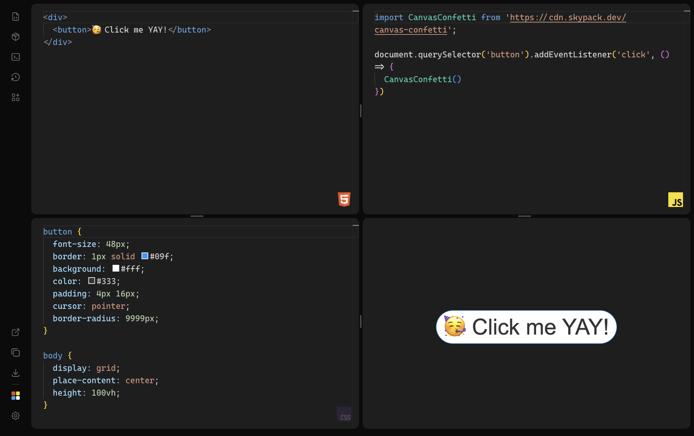

<div align="center">

  ###  [Codi.link](https://codi.link)

  ***Your HTML, CSS and JavaScript Playground Editor***
</div>

<div align="center">


</div>

<details>
  <summary>Table of Contents</summary>
  <ol>
    <li>
      <a href="#about-the-project">About The Project</a>
      <ul>
        <li><a href="#features">Features</a></li>
        <li><a href="#keyboard-shortcuts">Keyboard Shortcuts</a></li>
      </ul>
    </li>
    <li>
      <a href="#getting-started">Getting Started</a>
      <ul>
        <li><a href="#prerequisites">Prerequisites</a></li>
        <li><a href="#development">Development</a></li>
        <li><a href="#desktop-app">Desktop App</a></li>
        <li><a href="#built-with">Built With</a></li>
      </ul>
    </li>
    <li><a href="#license">License</a></li>
    <li><a href="#contact">Contact</a></li>
  </ol>
</details>

## About The Project



[codi.link](https://codi.link) is a live playground for HTML, CSS and JavaScript. Edit your code and see the result instantly, then share it with a URL or export it as a ZIP.

[Try a demo](https://codi.link/PGRpdj4KICA8YnV0dG9uPvCfpbMgQ2xpY2sgbWUgWUFZITwvYnV0dG9uPgo8L2Rpdj4=%7CYnV0dG9uIHsKICBmb250LXNpemU6IDQ4cHg7CiAgYm9yZGVyOiAxcHggc29saWQgIzA5ZjsKICBiYWNrZ3JvdW5kOiAjZmZmOwogIGNvbG9yOiAjMzMzOwogIHBhZGRpbmc6IDRweCAxNnB4OwogIGN1cnNvcjogcG9pbnRlcjsKICBib3JkZXItcmFkaXVzOiA5OTk5cHg7Cn0KCmJvZHkgewogIGRpc3BsYXk6IGdyaWQ7CiAgcGxhY2UtY29udGVudDogY2VudGVyOwogIGhlaWdodDogMTAwdmg7Cn0=%7CaW1wb3J0IENhbnZhc0NvbmZldHRpIGZyb20gJ2h0dHBzOi8vY2RuLmpzZGVsaXZyLm5ldC9ucG0vY2FudmFzLWNvbmZldHRpQDEuOS40Lytlc20nOwoKZG9jdW1lbnQucXVlcnlTZWxlY3RvcignYnV0dG9uJykuYWRkRXZlbnRMaXN0ZW5lcignY2xpY2snLCAoKSA9PiB7CiAgQ2FudmFzQ29uZmV0dGkoKQp9KQ==)

### Features

- **Live preview** — HTML, CSS and JS update in an isolated iframe as you type. CSS applies without a full reload.
- **Monaco editor** — the same engine as VS Code, with Emmet, HTML tag autocomplete, command palette, ligatures (Cascadia Code PL) and configurable font, tabs, word wrap, minimap and cursor.
- **Layouts** — six resizable layouts (`default`, `layout-2`, `vertical`, `horizontal`, `bottom`, `tabs`). Mobile always uses tabs.
- **Console** — captures `console` output from the preview, with a badge count and jump-to-line.
- **History** — save, rename and reopen previous sandboxes from local storage.
- **Demos** — built-in examples (counter, clock, todo, CSS orbs, theme toggle, typewriter).
- **npm packages** — search packages and inject a Skypack import into the JavaScript editor.
- **Share & export** — the URL stays in sync with your code; copy the link, open the preview in a new tab, or download a ZIP (separate files or a single HTML file).
- **Drag and drop** — drop `.html`, `.css` or `.js` files onto the editor.
- **Settings** — themes (Dark, Light, High Contrast, One Dark Pro, Dracula, Mosqueta Dark), UI language (English, Spanish, Portuguese), autosave, URL sync, max JS execution time and more.
- **Desktop app** — optional [Tauri](https://tauri.app) wrapper for a native window.

### Keyboard Shortcuts

| Shortcut | Action |
| --- | --- |
| `Ctrl/Cmd + S` | Download the current sandbox as a ZIP |
| `Ctrl/Cmd + P` | Open the editor command palette |
| `Ctrl/Cmd + ,` | Toggle settings |
| `Ctrl/Cmd + Shift + C` | Copy the shareable URL |

<p align="right"><a href="#top">Back to top 🔼</a></p>

## Getting Started

### Prerequisites

This project uses [Bun](https://bun.sh). Install it first if you do not have it.

### Development

Install dependencies:

```sh
bun install
```

Start the dev server:

```sh
bun dev
```

Other scripts:

```sh
bun run build   # production build
bun run serve   # preview the production build
bun run lint    # ESLint
```

A git pre-commit hook runs ESLint on staged JavaScript files.

### Desktop App

Requires [Rust](https://www.rust-lang.org/tools/install) in addition to Bun.

```sh
bun run tauri dev     # native window against the Vite dev server
bun run tauri build   # package the desktop app
```

### Built With

- JavaScript
- [Monaco Editor](https://microsoft.github.io/monaco-editor/)
- [Vite](https://vitejs.dev)
- [Zustand](https://zustand-demo.pmnd.rs)
- [Split Grid](https://github.com/nathancahill/split)
- [Tauri](https://tauri.app)
- [ESLint](https://eslint.org)
- [PostCSS](https://postcss.org)

<p align="right"><a href="#top">Back to top 🔼</a></p>

## License

Distributed under the [Creative Commons Attribution-NonCommercial-NoDerivatives 4.0](https://creativecommons.org/licenses/by-nc-nd/4.0/) license. See `LICENSE` for more information.

<p align="right"><a href="#top">Back to top 🔼</a></p>

## Contact 📭

**Miguel Ángel Durán @midudev**
[@midudev](https://twitter.com/midudev) - hi@midu.dev

<p align="right"><a href="#top">Back to top 🔼</a></p>
